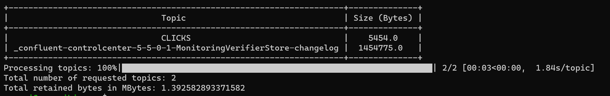

# Confluent cloud Kafka Topic Size Tool

This Python script retrieves the size of Kafka topics from a Confluent Cloud cluster. It fetches the retained bytes for each topic and displays them in a human-readable table. If no topics are specified, the script will print the size for all topics in the cluster.

## Requirements

- Python 3.x
- `requests` library
- `prettytable` library
- `tqdm` library

You can install the required libraries using the following command:

```bash
pip install requests prettytable tqdm
```
## Usage

Save the script as `topic_size.py`. To run the script, use the following command with the required command-line arguments:

```bash
python topic_size.py --cluster-api-key <cluster-api-key> \
                     --cluster-api-secret <cluster-api-secret> \
                     --cloud-api-key <cloud-api-key> \
                     --cloud-api-secret <cloud-api-secret> \
                     --env <environment> \
                     --cluster-id <cluster-id> \
                     [--topics <topic1> <topic2> ...]
```
### Command-line Arguments

- `--cluster-api-key`: The Cluster API key. (required)
- `--cluster-api-secret`: The Cluster API secret. (required)
- `--cloud-api-key`: The Cloud API key. (required)
- `--cloud-api-secret`: The Cloud API secret. (required)
- `--env`: The Confluent Cloud environment. (required)
- `--cluster-id`: The Cluster ID. (required)
- `--topics`: A list of specific topics to get the size of. If this argument is not provided, the script will print the size for all topics in the cluster. (optional)

Example command:

```bash
python topic_size.py --cluster-api-key FYQOARIQRY4MHC3H \
                     --cluster-api-secret xxxxxxxxxxxxxxxxxxxxxxx \
                     --cloud-api-key LTVZ7ND66A6N5PYJ \
                     --cloud-api-secret xxxxxxxxxxxxxxxxxxxxxxxxxxx \
                     --env t39219 \
                     --cluster-id lkc-v1nyz
```
## Output

The script will display a table with the topic names and their corresponding sizes in bytes. It will also display the total number of requested topics and the total retained bytes in MBytes. If the `--topics` argument is not provided, the script will print the size for all topics in the cluster.

Example output:
 


